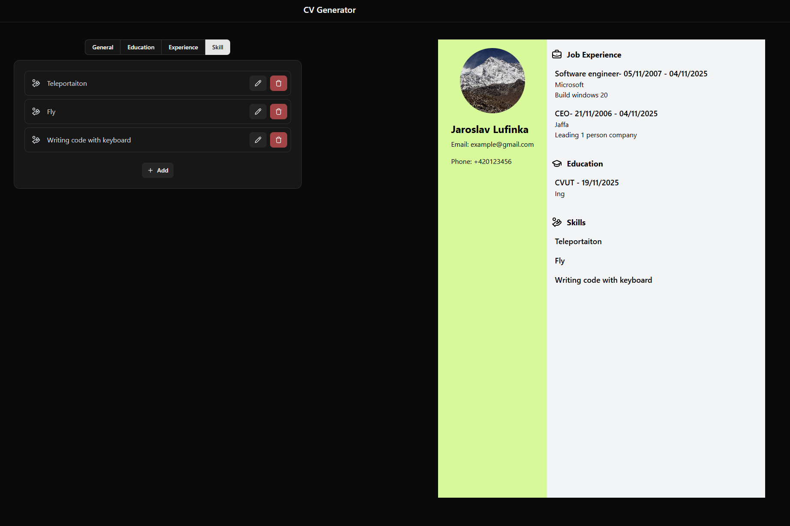

# CV Generator

A React-based CV generator application that allows users to create and customize professional resumes.

## Description

This project is a web application built with React that enables users to create, edit, and generate professional CVs/resumes. Users can input their personal information, work experience, education, skills, and other relevant details to generate a well-formatted resume.

## Tools & Technologies Used

- **React** - Frontend JavaScript library for building user interfaces
- **Tailwind CSS** - Utility-first CSS framework for styling
- **shadcn/ui** - Re-usable UI component library built on Radix UI and Tailwind CSS
- **HTML/CSS** - Markup and styling
- **JavaScript (ES6+)** - Programming language
- **Node.js** - Runtime environment
- **npm/yarn** - Package manager

## Features

- Interactive form for inputting personal and professional information
- Real-time preview of the CV

## Screenshots

_Main interface showing the CV editing form and live preview_
